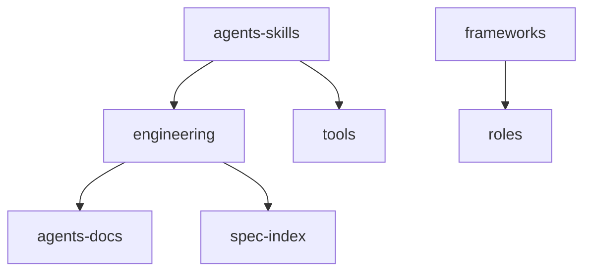

# 代码地图

## 树

```text
.
├── AGENTS.md                 # Agent 入口索引，指向 .agents/docs
├── design.md                 # 早期提纲（与 docs 重叠）
├── LICENSE
├── README.md                 # 空
├── skills/                   # 技能源码（按 category）
│   ├── engineering/          # 工程工作流
│   ├── langs/                # 语言（多为空占位）
│   ├── frameworks/           # 框架
│   ├── roles/                # 角色
│   └── tools/                # 工具
├── .agents/
│   ├── docs/                 # 本仓库持久知识（setup 产物）
│   ├── scripts/              # spec-files.mjs 副本
│   ├── cooking/              # 进行中需求（gitignore）
│   └── skills/               # 软链接，供本仓库 Agent 发现
└── .gitignore
```

忽略 `dist/`、`node_modules/`、`.git`。

## 模块

| 模块 | 路径 | 职责 | 主要入口 |
| --- | --- | --- | --- |
| engineering | `skills/engineering/` | 目标仓库可选工程流程：setup → explore/to-spec/to-tasks/implement/sync-spec/review/archive，rush 编排 | `README.md`、各技能 `SKILL.md` |
| langs | `skills/langs/` | 语言专项技能；go/node/rust/typescript 目前为空 | 各 `SKILL.md` |
| frameworks | `skills/frameworks/` | 框架专项；现仅 Vue 3，按 minor 读 reference | `vue/SKILL.md` |
| roles | `skills/roles/` | 角色约束；frontend-expert 有正文，backend-expert 为空 | `frontend-expert/SKILL.md` |
| tools | `skills/tools/` | git-commit；为库生成伴生技能 build-lib-skill | 各 `SKILL.md` |
| spec-index | `skills/engineering/sync-spec/scripts/spec-files.mjs` | 从 spec「影响文件」的新增/修改 rebuild 索引，再 parse/query/list | `spec-files.mjs` |
| agents-docs | `.agents/docs/` | 本仓库架构、规范、代码地图、已归档 SPECS | `ARCHITECTURE.md` |
| agents-skills | `.agents/skills/` | 指向 engineering 与 git-commit 的软链接 | 各 symlink |

## 依赖



`langs` 与空占位技能无代码依赖。`frameworks/vue` 写前端时与 `roles/frontend-expert` 同时适用，无文件级 import。

## 关键路径

- **本仓库改技能**：改 `skills/<category>/<name>/`；`.agents/skills/` 已有对应链接则不必动链接。
- **目标仓库 setup**：读 `skills/engineering/setup/`，在目标根写入 `.agents/docs`、`.agents/cooking`、复制 `spec-files.mjs`、精简 `AGENTS.md`。
- **规格反查**：`node .agents/scripts/spec-files.mjs query .agents/docs/SPECS/files-index.json <变更文件...>`（会先扫描归档 spec 重建索引），命中再打开对应 spec。
