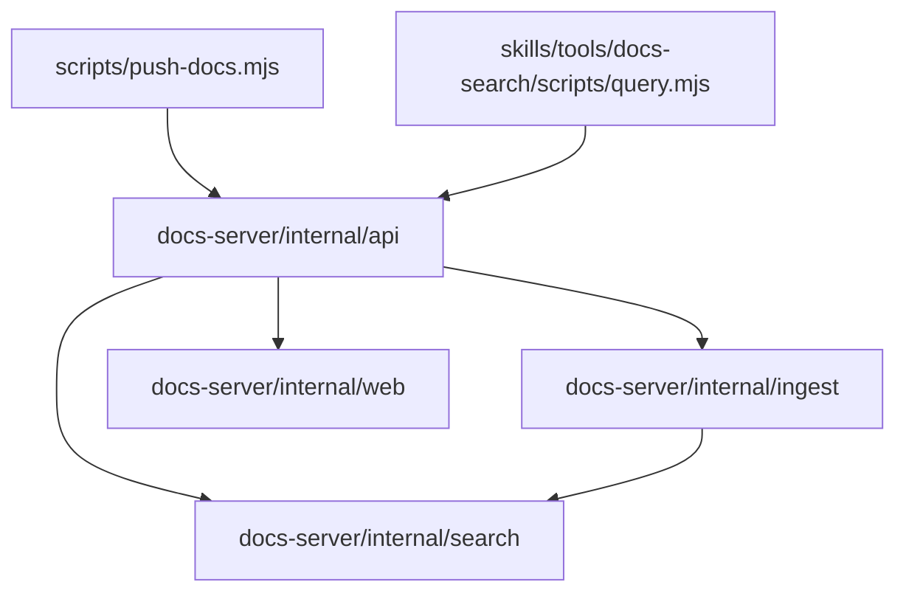

# 代码地图

> 范围：本文只覆盖 docs-server 子项目。仓库其余部分（`skills/` 技能包、`docs/` 门户）不在此图。

子项目的 `docs-server/`、`scripts/`、`skills/tools/docs-*` 与部署产物（CI 二进制发布）均已落地。

## 树

```
prompt-engineering/          # 本仓库：技能包 + docs-server 子项目
├── docs-server/              # Go 模块，文档检索 REST 单服务
│   ├── cmd/docs-server/      # main：装配配置、存储、REST handler，起 HTTP 服务
│   └── internal/
│       ├── api/              # REST handler 与路由（/api/v1/），推送 Bearer 鉴权
│       ├── ingest/           # 接收推送：frontmatter 解析、整批校验、整库替换写库
│       ├── search/           # SQLite FTS5 索引与全文检索
│       └── web/              # go:embed 内嵌静态 UI 与根路径 handler
├── scripts/
│   └── push-docs.mjs         # 零依赖 Node 推送脚本，用户复制到库仓库使用
├── skills/tools/
│   ├── docs-search/          # 检索技能：AI 运行内嵌查询脚本调 REST
│   └── docs-gen/             # 库文档生成技能：文档标准/变更同步/推送；内含脚本副本
└── .github/workflows/        # GitHub Actions：ci.yml（paths 过滤测试）+ release.yml（v* tag 发版）
```

## 模块

| 模块 | 路径 | 职责 | 主要入口 |
| --- | --- | --- | --- |
| 服务端入口 | `docs-server/cmd/docs-server/` | 装配配置、存储、REST handler，起服务 | `docs-server/cmd/docs-server/main.go` |
| REST API 层 | `docs-server/internal/api/` | 路由、推送 Bearer 鉴权、请求/响应、错误格式 | `docs-server/internal/api/` |
| 推送接收 | `docs-server/internal/ingest/` | frontmatter 解析、整批校验、整库替换写入 | `docs-server/internal/ingest/` |
| 索引与检索 | `docs-server/internal/search/` | SQLite FTS5 建索引、bm25 标题与别名加权、高亮片段、AND/OR 降级检索、章节切片 | `docs-server/internal/search/` |
| 内置 Web UI | `docs-server/internal/web/` | 内置只读 Web UI 静态资源与挂载 | `docs-server/internal/web/` |
| 推送脚本 | `scripts/push-docs.mjs` | 扫描库内文档，HTTP 全量推送到服务端 | `scripts/push-docs.mjs` |
| docs-search 技能 | `skills/tools/docs-search/` | 通用检索技能：指导 AI 运行内嵌脚本 list_libraries / search / get_document | `skills/tools/docs-search/SKILL.md` |
| 查询脚本 | `skills/tools/docs-search/scripts/query.mjs` | 零依赖 Node 脚本，读 `DOCS_SERVER_URL` 调 REST，stdout 打印 JSON | `skills/tools/docs-search/scripts/query.mjs` |
| docs-gen 技能 | `skills/tools/docs-gen/` | 库文档生成技能（只服务库）：文档标准/安装脚本/引导 .env/库代码改动后判定并同步受影响文档/执行推送；脚本副本须与 `scripts/push-docs.mjs` 同步 | `skills/tools/docs-gen/SKILL.md` |

## 依赖



## 关键路径

- 推送：库仓库执行 `push-docs.mjs` → PUT 服务端 `api`（Bearer 鉴权）→ `ingest`（frontmatter 解析 + 整批校验）→ 整库替换写 SQLite 并重建 FTS5 索引。
- 检索：agent 宿主运行 `docs-search` 查询脚本 → GET 服务端 REST（list_libraries / search / get_document）→ `api` → `search` 查 FTS5 → JSON 经 stdout 返回。
